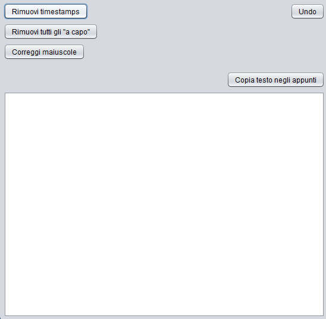

# Easy Text Edit
This is a simple Java Swing application designed to help you quickly clean up and format text, especially useful for raw text from sources like transcriptions or logs. New features are still in development.

# Table of Contents
- [Features](#features)
- [Java Concepts and Features](#Java-Concepts-and-Features)
- [Usage](#Usage)
- [Screenshot](#screenshot)

## Features
* **Remove Timestamps**: Quickly remove lines that look like timestamps (e.g., "01:23:45 Some Text") from your text.
* **Remove All Line Breaks**: Convert all line breaks (`\n`) into spaces, effectively making your multi-line text into a single continuous paragraph.
* **Copy Text to Clipboard**: Copy the entire content of the text area to your system clipboard with a single click.
* **Undo**: Revert the last text modification you made.
* **Correct Capitalization**: Automatically capitalize the first letter of sentences following punctuation marks (`.`, `!`, `?`).

## Java Concepts and Features
- String Manipulation
- Static UI via FXML
- Java Swing UI

## Usage
1.  **Paste Text**: Paste your raw text into the large text area.
2.  **Apply Transformations**:
    * Click "**Remove timestamps**" to clean up timestamped lines.
    * Click "**Remove all line breaks**" to convert multiline text into a single line.
    * Click "**Correct capitalization**" to fix sentence-starting capitalization.
4.  **Undo**: If you make a mistake, click "**Undo**" to revert to the previous state.
5.  **Copy**: Click "**Copy text to clipboard**" to copy the processed text.

## Screenshot

